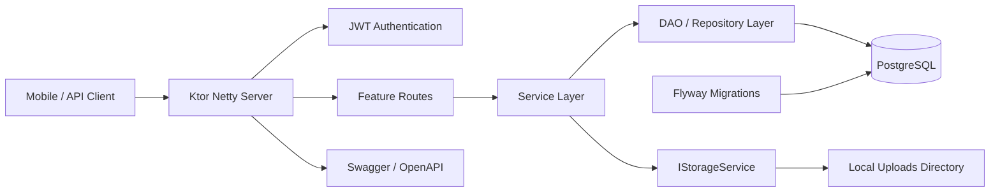
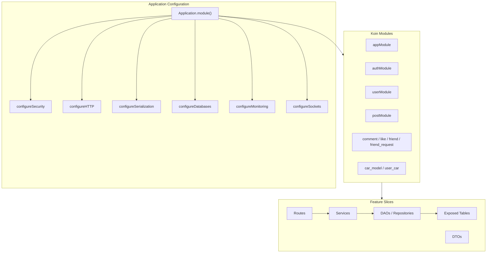
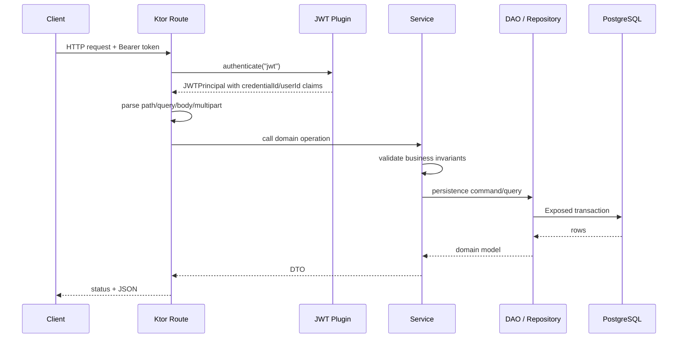
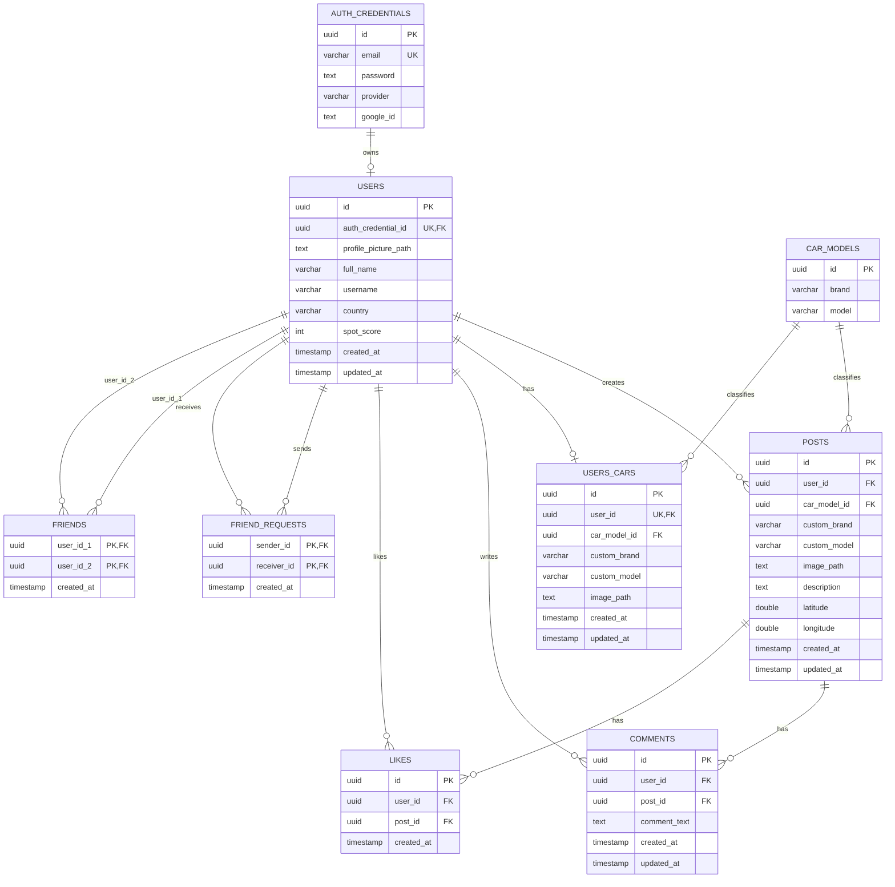
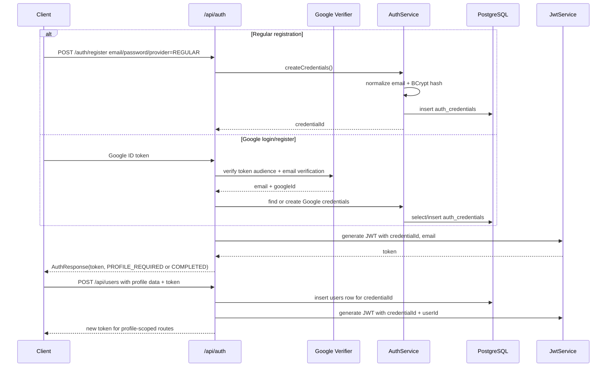
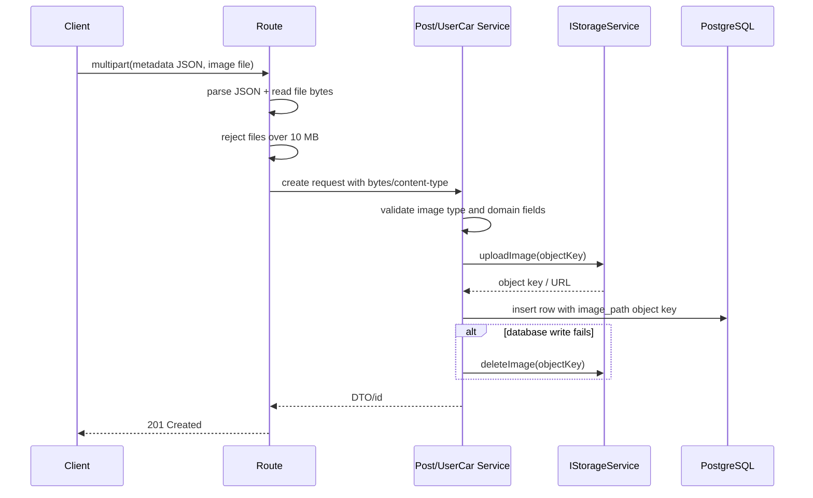

# 🚗 CarSpotter Server


CarSpotter Server is the Kotlin/Ktor backend for a social car spotting application. It manages authentication, user profiles, posts with image uploads, car model lookup, likes, comments, friendships, friend requests, and a single-car profile per user.

The codebase is intentionally organized around feature modules and explicit boundaries: routes handle HTTP concerns, services own business rules, DAOs/repositories isolate persistence, Flyway owns schema evolution, and storage is accessed through an interface rather than hard-wired into post/user-car logic.

This README documents the system as implemented. It avoids aspirational claims and calls out the places where the current implementation leaves room for production hardening.

## Table Of Contents

- [System Overview](#system-overview)
- [Architecture](#architecture)
- [Project Structure](#project-structure)
- [Request Flow](#request-flow)
- [Domain Modules](#domain-modules)
- [Database Design](#database-design)
- [Authentication Flow](#authentication-flow)
- [Image Upload Flow](#image-upload-flow)
- [API Overview](#api-overview)
- [Configuration](#configuration)
- [Local Development](#local-development)
- [Docker](#docker)
- [Testing Strategy](#testing-strategy)
- [Operational Notes](#operational-notes)
- [Security Considerations](#security-considerations)
- [Scalability Roadmap](#scalability-roadmap)
- [Engineering Tradeoffs](#engineering-tradeoffs)
- [Key Engineering Decisions](#key-engineering-decisions)

## System Overview

CarSpotter is built as a modular monolith. That is the right level of distribution for the current product surface: the domain is still cohesive, most workflows share the same user/post/social graph, and strong relational constraints are valuable.



Core runtime components:

| Concern | Implementation |
| --- | --- |
| HTTP server | Ktor 3 on Netty |
| Dependency injection | Koin modules per feature |
| Persistence | PostgreSQL through Exposed JDBC |
| Migrations | Flyway SQL migrations in `server/src/main/resources/db/migrations` |
| Connections | HikariCP, max pool size 10, `REPEATABLE_READ` transactions |
| Auth | HMAC JWT with `credentialId`, optional `userId`, `email`, `isAdmin` claims |
| Password hashing | BCrypt cost 12 |
| Google sign-in | Google ID token verification with configured audience |
| Media | Multipart upload to `IStorageService`; current implementation stores files locally |
| API docs | Swagger UI at `/swagger`, OpenAPI document at `/openapi` |
| Tests | DAO, service, and route tests with Testcontainers PostgreSQL |

## Architecture

Each feature owns the same set of concepts when needed:

```text
Route -> Service -> Repository? -> DAO -> Exposed Table -> PostgreSQL
             |
             +-> DTO mapping / validation / storage / auth-derived decisions
```

The repository layer appears where it adds a domain-oriented abstraction (`friend`, `friend_request`). Simpler features such as `post`, `comment`, `like`, and `user_car` call DAOs from services directly. This keeps the codebase consistent without forcing an extra layer everywhere.



Why this structure works well here:

- Feature ownership is clear. A change to posts usually stays in `features/post`, with shared infrastructure under `core` or `config`.
- HTTP details do not leak into DAOs. Routes parse Ktor calls; services enforce business rules; DAOs express persistence.
- Schema guarantees are centralized in Flyway. Exposed table objects mirror table shape for queries, but the migration is the source of truth for constraints and indexes.
- Storage is abstracted behind `IStorageService`, so post and user-car services depend on object keys and URLs rather than local filesystem details.

## Project Structure

```text
.
├── Dockerfile
├── README.md
└── server
    ├── build.gradle.kts
    ├── docker-compose.yml
    ├── postgres/init/01-init-multiple-dbs.sh
    ├── src/main/kotlin
    │   ├── Application.kt
    │   ├── config
    │   │   ├── Databases.kt
    │   │   ├── HTTP.kt
    │   │   ├── Monitoring.kt
    │   │   ├── Routing.kt
    │   │   ├── Security.kt
    │   │   ├── Serialization.kt
    │   │   └── Sockets.kt
    │   ├── core
    │   │   ├── di/AppModule.kt
    │   │   ├── serialization
    │   │   ├── storage
    │   │   └── util
    │   └── features
    │       ├── auth
    │       ├── car_model
    │       ├── comment
    │       ├── friend
    │       ├── friend_request
    │       ├── like
    │       ├── post
    │       ├── user
    │       └── user_car
    ├── src/main/resources
    │   ├── application.yaml
    │   ├── db/migrations/V1__init.sql
    │   ├── logback.xml
    │   └── openapi/documentation.yaml
    └── src/test/kotlin
        ├── dao
        ├── routes
        ├── service
        └── testutils
```

## Request Flow

Most authenticated requests follow this path:



Not every authenticated token contains a `userId`. Registration can create credentials first, then profile creation issues a second token that includes the user profile identity. Routes that need a completed profile explicitly require `userId`; account-level routes can operate with `credentialId`.

## Domain Modules

| Module | Responsibility | Notable design details |
| --- | --- | --- |
| `auth` | Register/login, Google login, password update, account deletion, JWT generation | Separates credentials from profiles; supports staged onboarding; regular credentials use BCrypt; Google credentials store `google_id` and no password |
| `user` | Public profile lookup, profile creation, `/me`, profile picture path update | Enforces normalized lowercase usernames and one user profile per credential |
| `car_model` | Read-only brand/model catalog lookup | Supports canonical car model IDs while allowing custom brand/model fallback in posts and user cars |
| `post` | Feed, user posts, post detail, create/delete post with image | Multipart metadata + image upload; validates content type, image size, caption length, coordinates, and car source |
| `comment` | List, create, delete comments | Reads comments with author username/avatar in one query; returns empty list without checking post existence to avoid an extra query |
| `like` | Toggle like and read like status | Unique `(user_id, post_id)` prevents duplicate likes; optional JWT on status endpoint lets anonymous clients get counts |
| `friend` | Add/delete/list friendships | Stores symmetric friendships as a canonical ordered pair to avoid duplicate inverse rows |
| `friend_request` | Send, accept, decline, list requests | Accept converts a request into a canonical friendship row |
| `user_car` | One showcased car per user with image | Mirrors post car-source validation and stores either catalog model or custom brand/model |

## Database Design

The schema is managed by `V1__init.sql`. It uses UUID primary keys, relational foreign keys, check constraints, uniqueness constraints, and targeted indexes for common access patterns.



### Important Constraints And Indexes

| Table | Constraint / index | Why it exists |
| --- | --- | --- |
| `auth_credentials` | `email UNIQUE` | Prevents multiple login identities for the same normalized email |
| `auth_credentials` | `provider_consistency_check` | Ensures regular accounts have a password and no Google ID, while Google accounts have a Google ID and no password |
| `users` | `auth_credential_id UNIQUE REFERENCES auth_credentials ON DELETE CASCADE` | Enforces one profile per credential and removes profile data when credentials are deleted |
| `users` | `idx_users_username_lower` | Gives case-insensitive username uniqueness at the database boundary |
| `users` | username, score, birth date, role checks | Keeps core user invariants valid even if application validation is bypassed |
| `car_models` | `UNIQUE (brand, model)` | Keeps the catalog canonical and avoids duplicate dropdown options |
| `posts` | `chk_post_car_source` | A post must reference exactly one source of car identity: catalog model or custom brand/model |
| `posts` | latitude/longitude range and pair checks | Prevents partial or invalid geolocation data |
| `posts` | description non-blank/max length checks | Preserves API-level content rules at the storage layer |
| `posts` | `idx_posts_created`, `idx_posts_user_created` | Supports feed and user-profile post listing ordered by newest first |
| `comments` | `idx_comments_post_created`, `idx_comments_user` | Supports post comment retrieval and user-scoped access patterns |
| `likes` | `UNIQUE (user_id, post_id)`, `idx_likes_post` | Prevents duplicate likes and supports count/status queries |
| `friends` | composite PK `(user_id_1, user_id_2)` and `chk_friend_pair_order` | Stores each friendship once as a canonical sorted pair |
| `friend_requests` | composite PK `(sender_id, receiver_id)` | Prevents duplicate pending requests between the same users in the same direction |
| `users_cars` | `user_id UNIQUE` and `chk_user_car_source` | Enforces one showcased car per user and exactly one car identity source |

## Authentication Flow

CarSpotter distinguishes authentication credentials from user profiles. That allows a user to register or sign in first, then complete profile onboarding separately.



JWT behavior:

- `jwt` authentication requires a valid token containing a UUID `credentialId`.
- Domain routes such as posts, comments, likes, friends, and user-car operations require `userId` from the token.
- `admin` authentication uses the same JWT verifier and additionally requires `isAdmin=true`.
- Tokens expire after 24 hours.

## Image Upload Flow

Posts and user cars use multipart uploads. The route parses JSON metadata from a `metadata` form part and image bytes from an `image` file part.



Current storage implementation:

- Stores images under `LOCAL_STORAGE_BASE_DIR` or `uploads` by default.
- Serves files via Ktor static files at `/uploads`.
- Builds public URLs from `PUBLIC_BASE_URL`.
- Defends against path traversal by normalizing object keys and requiring them to stay inside the base directory.
- Uses date-partitioned object keys such as `posts/2026/05/07/<uuid>.jpg` and `user-cars/2026/05/07/<uuid>.webp`.

The AWS S3 SDK is already present as a dependency, but the active implementation is local filesystem storage. Adding S3 should be done by implementing `IStorageService`, not by changing post/user-car services.

## API Overview

All API routes are mounted under `/api`.

| Method | Path | Auth | Purpose |
| --- | --- | --- | --- |
| `POST` | `/auth/register` | Public | Create regular or Google credentials |
| `POST` | `/auth/login` | Public | Login with regular credentials or Google ID token |
| `DELETE` | `/auth/account` | JWT | Delete current credential record |
| `PUT` | `/auth/password` | JWT | Update password for regular accounts |
| `GET` | `/users/{userId}` | Public | Read public profile |
| `POST` | `/users` | JWT with `credentialId` | Create profile for the authenticated credential |
| `GET` | `/users/me` | JWT with `userId` | Read current profile |
| `PATCH` | `/users/me/profile-picture` | JWT with `userId` | Update stored profile picture path |
| `GET` | `/car-models/brands` | Public | List car brands |
| `GET` | `/car-models/brands/{brand}/models` | Public | List models for a brand |
| `GET` | `/posts/feed?limit=&offset=` | Public | List latest posts |
| `GET` | `/users/{userId}/posts?limit=&offset=` | Public | List posts by user |
| `GET` | `/posts/{postId}` | Public | Read post detail |
| `POST` | `/posts` | JWT with `userId` | Create post with image |
| `DELETE` | `/posts/{postId}` | JWT with `userId` | Delete own post |
| `GET` | `/posts/{postId}/comments` | Public | List comments |
| `POST` | `/posts/{postId}/comments` | JWT with `userId` | Add comment |
| `DELETE` | `/comments/{commentId}` | JWT with `userId` | Delete own comment |
| `GET` | `/posts/{postId}/likes` | Optional JWT | Read like count and current user's liked status |
| `POST` | `/posts/{postId}/likes` | JWT with `userId` | Toggle like |
| `GET` | `/users/{userId}/car` | Public | Read a user's showcased car |
| `GET` | `/me/car` | JWT with `userId` | Read current user's showcased car |
| `POST` | `/me/car` | JWT with `userId` | Create showcased car with image |
| `PATCH` | `/me/car` | JWT with `userId` | Update showcased car metadata and/or image |
| `DELETE` | `/me/car` | JWT with `userId` | Delete showcased car |
| `GET` | `/friends` | JWT with `userId` | List friends |
| `POST` | `/friends/{friendId}` | JWT with `userId` | Add friend directly |
| `DELETE` | `/friends/{friendId}` | JWT with `userId` | Delete friendship |
| `GET` | `/friends/admin` | Admin JWT | Inspect all friendship rows |
| `GET` | `/friend-requests` | JWT with `userId` | List friend requests |
| `POST` | `/friend-requests/{receiverId}` | JWT with `userId` | Send request |
| `POST` | `/friend-requests/{senderId}/accept` | JWT with `userId` | Accept request |
| `POST` | `/friend-requests/{senderId}/decline` | JWT with `userId` | Decline request |
| `GET` | `/friend-requests/admin` | Admin JWT | Inspect all friend-request rows |
| `GET` | `/swagger` | Public | Swagger UI |
| `GET` | `/openapi` | Public | OpenAPI document |
| `WS` | `/ws` | Public | Basic echo WebSocket endpoint |

### API Examples

Register regular credentials:

```bash
curl -X POST http://localhost:8080/api/auth/register \
  -H 'Content-Type: application/json' \
  -d '{
    "email": "driver@example.com",
    "password": "StrongPass123!",
    "provider": "REGULAR"
  }'
```

Create a profile after registration:

```bash
curl -X POST http://localhost:8080/api/users \
  -H "Authorization: Bearer $TOKEN" \
  -H 'Content-Type: application/json' \
  -d '{
    "fullName": "Alex Driver",
    "username": "alex.driver",
    "birthDate": "1998-04-12",
    "country": "Romania",
    "profilePicturePath": null,
    "phoneNumber": null
  }'
```

Create a post with catalog car model metadata:

```bash
curl -X POST http://localhost:8080/api/posts \
  -H "Authorization: Bearer $TOKEN" \
  -F 'metadata={
    "carModelId": "00000000-0000-0000-0000-000000000000",
    "caption": "Spotted downtown",
    "latitude": 44.4268,
    "longitude": 26.1025
  };type=application/json' \
  -F 'image=@./spot.webp;type=image/webp'
```

Create a post with custom car metadata:

```bash
curl -X POST http://localhost:8080/api/posts \
  -H "Authorization: Bearer $TOKEN" \
  -F 'metadata={
    "customBrand": "Rimac",
    "customModel": "Nevera",
    "caption": "Rare one"
  };type=application/json' \
  -F 'image=@./spot.jpg;type=image/jpeg'
```

Toggle a like:

```bash
curl -X POST http://localhost:8080/api/posts/$POST_ID/likes \
  -H "Authorization: Bearer $TOKEN"
```

## Configuration

`application.yaml` defines the Ktor module and binds the server to `0.0.0.0:8080`. Runtime configuration is read from environment variables and, for JWT settings, also from JVM system properties.

### Application Variables

| Variable | Required | Used by | Notes |
| --- | --- | --- | --- |
| `KTOR_ENV` | No | `configureDatabases()` | Defaults to `development`; valid values are `development`, `testing`, `production` |
| `DEV_DB_URL` | Development | Database config | May be `postgresql://...` or `jdbc:postgresql://...` |
| `DEV_USER` | Development | Database config | Development database user |
| `DEV_PASSWORD` | Development | Database config | Development database password |
| `TEST_DB_URL` | Testing | Database config | Used when `KTOR_ENV=testing` |
| `TEST_DB_USER` | Testing | Database config | Testing database user |
| `TEST_DB_PASSWORD` | Testing | Database config | Testing database password |
| `PROD_DB_URL` | Production | Database config | Used when `KTOR_ENV=production` |
| `PROD_USER` | Production | Database config | Production database user |
| `PROD_PASSWORD` | Production | Database config | Production database password |
| `JWT_SECRET` | Yes | JWT signing/verifying | Must be high entropy |
| `JWT_ISSUER` | Yes | JWT signing/verifying | Must match generated and verified tokens |
| `JWT_AUDIENCE` | Yes | JWT signing/verifying | Must match generated and verified tokens |
| `GOOGLE_CLIENT_ID` | Yes for Google auth | Google token verifier | Audience for Google ID token verification |
| `LOCAL_STORAGE_BASE_DIR` | No | Local storage | Defaults to `uploads` |
| `PUBLIC_BASE_URL` | No | URL generation | Defaults to `http://localhost:8080` |

### Docker Init Variables

The Docker Postgres init script creates separate development, testing, and production databases/users. When using `server/docker-compose.yml`, provide:

```env
POSTGRES_USER=
POSTGRES_PASSWORD=

DEV_DB=
DEV_USER=
DEV_PASSWORD=
DEV_DB_URL=

TEST_DB=
TEST_DB_USER=
TEST_DB_PASSWORD=
TEST_DB_URL=

PROD_DB=
PROD_USER=
PROD_PASSWORD=
PROD_DB_URL=

KTOR_ENV=development
JWT_SECRET=
JWT_ISSUER=
JWT_AUDIENCE=
GOOGLE_CLIENT_ID=
LOCAL_STORAGE_BASE_DIR=uploads
PUBLIC_BASE_URL=http://localhost:8080
```

Note: the checked-in `server/.env.example` currently contains only a smaller subset of these values. The application code and Docker init script require the expanded shape above.

When running the app inside Docker Compose, the database hostname is `postgres`. When running `./gradlew run` directly on the host machine against the Compose database, use `localhost` in the database URL instead.

## Local Development

Prerequisites:

- JDK 17
- Docker, for local PostgreSQL and Testcontainers-backed tests
- Kotlin/Gradle through the checked-in Gradle wrapper

Start PostgreSQL with Docker Compose:

```bash
cd server
cp .env.example .env
# Edit .env to include the full variables shown above.
docker compose up -d postgres
```

Run the server:

```bash
cd server
set -a
source .env
set +a
./gradlew run
```

Build the executable fat jar:

```bash
cd server
./gradlew shadowJar
java -jar build/libs/server-all.jar
```

Run tests:

```bash
cd server
./gradlew test
```

Useful local URLs:

- API base: `http://localhost:8080/api`
- Swagger UI: `http://localhost:8080/swagger`
- OpenAPI document: `http://localhost:8080/openapi`
- Uploaded files: `http://localhost:8080/uploads/...`

## Docker

The root `Dockerfile` is a multi-stage build:

1. Uses `eclipse-temurin:17-jdk` to run Gradle and build the server jar.
2. Uses `eclipse-temurin:17-jre` for a smaller runtime image.
3. Copies the shaded jar and starts it with `java -jar app.jar`.

Run the full stack:

```bash
cd server
docker compose up --build
```

The Compose file defines:

- `postgres`: PostgreSQL 15 with a persistent volume, initialization script, and healthcheck.
- `app`: CarSpotter server built from the root Dockerfile, waiting for PostgreSQL health before startup.

## Testing Strategy

The test suite is organized by layer:

| Layer | Location | What it validates |
| --- | --- | --- |
| DAO tests | `server/src/test/kotlin/dao` | SQL mappings, constraints, inserts, reads, deletes |
| Service tests | `server/src/test/kotlin/service` | Business rules and validation behavior |
| Route tests | `server/src/test/kotlin/routes` | HTTP status codes, auth boundaries, serialization, multipart behavior |
| Test utilities | `server/src/test/kotlin/testutils` | Test database lifecycle, route module wiring, seed data |

Tests use a real PostgreSQL container via Testcontainers and apply the same Flyway migrations as the application. That is an important design choice: it catches differences between expected schema behavior and real PostgreSQL behavior, especially for constraints, foreign keys, transactions, and indexes.

## Operational Notes

Current production-aware behavior:

- Flyway migrations run at startup before Exposed connects.
- HikariCP owns connection pooling.
- Call logging is installed at `INFO`.
- Gzip/deflate compression is enabled.
- Static upload serving is isolated under `/uploads`.
- Database URLs are normalized from `postgresql://` to JDBC URLs when needed.
- Docker Compose waits for PostgreSQL health before starting the app.

Production hardening still needed:

- Replace permissive CORS `anyHost()` with explicit trusted origins.
- Remove debug `println` statements from the Google auth path and rely on structured logging without sensitive values.
- Add rate limiting for auth, uploads, comments, likes, and friend-request endpoints.
- Move local file storage to durable object storage for multi-instance deployments.
- Add centralized error handling via Ktor `StatusPages`; the dependency is present, but route-level handlers currently do most response mapping.
- Add observability beyond call logs: metrics, tracing, structured request IDs, and health/readiness endpoints.
- Reconcile generated OpenAPI documentation with current route names where it has drifted.

## Security Considerations

Implemented controls:

- JWT verification checks issuer, audience, signature, and required UUID `credentialId`.
- Admin routes use a separate `admin` authentication provider requiring `isAdmin=true`.
- Regular passwords are hashed with BCrypt before persistence.
- Google sign-in verifies the ID token and requires verified Google email.
- Profile usernames are normalized and validated before insert.
- File uploads are constrained to `image/jpeg`, `image/png`, and `image/webp`.
- Upload routes reject files larger than 10 MB.
- Storage path resolution prevents object keys from escaping the configured upload directory.
- Database constraints enforce provider consistency, friendship ordering, non-self friendships, non-self requests, geolocation validity, non-blank content, uniqueness, and foreign-key integrity.

Security caveats:

- JWTs are stateless and currently have a fixed 24-hour expiration; there is no refresh token rotation or server-side token revocation.
- `JWT_SECRET` must be strong and environment-specific. A weak shared secret undermines every protected route.
- The database has a `users.role` column and the JWT verifier supports `isAdmin`, but normal token issuance currently defaults `isAdmin` to `false`; production admin access should be tied to a deliberate role-to-claim issuing path.
- Local filesystem media storage is suitable for development and single-instance deployments, not horizontally scaled production.
- CORS is intentionally permissive in the current code and should be narrowed before public deployment.
- Upload validation checks content type and size, but not file signature scanning or malware detection.

## Scalability Roadmap

The current design gives a clean path to scale without prematurely splitting the system.

Near-term:

- Add keyset pagination for feeds instead of offset pagination once feed volume grows.
- Add indexes for emerging query patterns rather than speculatively indexing every column.
- Add Redis or another cache for car model lists, like counts, and profile lookups if read traffic justifies it.
- Replace local storage with S3-compatible object storage through `IStorageService`.
- Add rate limiting and abuse controls for social write endpoints.

Mid-term:

- Move expensive feed construction into dedicated query models or materialized views if simple chronological feed listing becomes insufficient.
- Add background jobs for image processing, cleanup retries, and notification delivery.
- Introduce an outbox table if friend requests, notifications, or scoring need reliable async side effects.
- Split OpenAPI generation/validation into CI so docs stay aligned with routes.

Long-term:

- Keep the modular monolith until operational pressure justifies service boundaries.
- If the system is split later, likely boundaries are media storage/processing, notifications, and feed generation. Auth, users, and social graph should stay strongly consistent as long as possible.

## Engineering Tradeoffs

| Decision | Benefit | Tradeoff |
| --- | --- | --- |
| Modular monolith | Simple deployment, strong relational consistency, fast iteration | Requires discipline to keep feature boundaries clean |
| Exposed JDBC | Type-safe Kotlin SQL DSL and straightforward transactions | DAO code is still close to SQL and can become verbose for complex projections |
| Flyway as schema authority | Repeatable schema evolution with reviewable SQL | Exposed table definitions must be kept aligned manually |
| Offset pagination | Simple API and implementation | Degrades for deep pages and can shift under concurrent writes |
| Local storage implementation | Easy development, no cloud dependency | Not suitable for multi-instance production without shared storage |
| Route-level error handling | Explicit behavior per endpoint | Cross-cutting error behavior can become repetitive |
| Canonical friendship rows | Prevents duplicate inverse relationships | All friendship writes must sort UUID pairs consistently |
| Staged auth/profile onboarding | Supports account creation before profile completion | Some tokens intentionally lack `userId`, so routes must be precise about required claims |

## Key Engineering Decisions

### Ktor For Explicit Backend Composition

Ktor fits this project because it keeps server composition visible. Authentication, CORS, compression, serialization, logging, routing, WebSockets, Swagger, and database setup are configured directly in `Application.module()`. That makes the runtime easy to audit: there is no large framework lifecycle hiding where middleware enters the request path.

The tradeoff is that the codebase must define its own conventions for error handling, validation, and module boundaries. This project addresses that with feature slices and service-level rules, but a future `StatusPages` layer would reduce repeated route error mapping.

### Feature Modules Over Horizontal Technical Folders

The project is organized by domain feature rather than by global folders such as `routes`, `services`, and `daos`. For a product backend, this scales better for day-to-day work because a change to comments, posts, or user cars is easy to localize.

Shared concerns still live in `core` and `config`: serializers, JWT helpers, storage, dependency wiring, HTTP plugins, and database setup. That keeps reuse available without turning every feature into a cross-package edit.

### Flyway + PostgreSQL Constraints As A First-Class Boundary

The migration does not treat the database as passive storage. It encodes business invariants:

- provider/password/Google consistency,
- one profile per credential,
- case-insensitive username uniqueness,
- one car identity source for posts and user cars,
- valid coordinate pairs,
- one like per user/post,
- canonical friendship rows.

This matters because service validation improves API ergonomics, but database constraints protect the system from bugs, concurrent writes, scripts, and future code paths.

### Exposed For Persistence Without Hiding SQL Shape

Exposed is used as a Kotlin DSL over JDBC transactions. The DAO layer still makes joins, selected columns, ordering, limits, and deletes visible. That is a good fit for this codebase because the data model is relational and query behavior matters.

The project avoids pushing Exposed calls directly into routes. That keeps HTTP handling separate from persistence and makes service/DAO tests meaningful.

### Credentials And Profiles Are Separate

`auth_credentials` and `users` are separate tables. This models the real onboarding lifecycle: a person can authenticate before completing their public profile. It also allows account deletion to cascade through the profile and dependent rows via foreign keys.

The implication is that tokens may represent two states:

- credential-only token: enough to create a profile or manage account credentials,
- completed-profile token: includes `userId` and can create posts, likes, comments, friendships, and user cars.

### Car Identity Supports Canonical And Custom Sources

Posts and user cars can reference a canonical `car_models` row or provide a custom brand/model pair. The schema enforces that exactly one source is used.

This is a practical domain decision. A curated model catalog improves consistency and searchability, but real car communities need room for rare, modified, new, or missing models. The XOR-style constraint keeps that flexibility from becoming ambiguous data.

### Storage Is Abstracted At The Service Boundary

The services do not write directly to `Files.write`; they depend on `IStorageService`. The current implementation is local filesystem storage, but the dependency direction already supports S3-compatible storage later.

The upload flow also compensates for partial failure: if the image upload succeeds but the database insert fails, the service attempts to delete the uploaded object. That is not a full distributed transaction, but it is a sensible cleanup strategy for a backend at this stage.

### Canonical Friendships Prevent Graph Duplication

The `friends` table stores one row per friendship using ordered UUID pairs and a composite primary key. This prevents storing both `(A, B)` and `(B, A)`, simplifies uniqueness, and keeps friendship deletion deterministic.

The tradeoff is that every insert/delete must canonicalize the pair. The DAO makes that rule explicit with a `canonicalPair` helper, and the database enforces it with `chk_friend_pair_order`.

### Tests Exercise Real PostgreSQL Behavior

The tests use Testcontainers PostgreSQL and apply Flyway migrations. That is more expensive than pure in-memory tests, but it is the right tradeoff here because many important guarantees live in PostgreSQL itself: check constraints, composite keys, foreign keys, indexes, and transaction behavior.

This gives higher confidence that route/service/DAO behavior matches production database semantics instead of a simplified test double.
